# Safestop

**Make agents you can actually turn off.**

Safestop is a governance protocol for agentic workflows. It forces you to answer six questions before deploying: What can it do? When is it uncertain? How do you challenge it? How do you stop it? What evidence does it leave? Who owns the outcome?

If you can't answer these, your agent isn't ready for production.

---

## Why Safestop?

Most AI governance is aspirational principles or post-incident audits. Safestop is **pre-deployment gates and runtime enforcement**.

Before deploying an agentic workflow, Safestop requires six artifacts:

1. **Authority Boundary** – quantified limits ($ amounts, record counts, blast radius)
2. **Ambiguity Handling** – where uncertain cases route (human / defer / tighten)
3. **Contest Path** – real appeals that can change outcomes
4. **Reversibility Plan** – commit points, undo strategy, kill switches
5. **Decision Receipt** – plain language + machine-readable records
6. **Ownership + Escalation** – who's accountable, how to escalate

These aren't documents. They're **JSON schemas** validated at CI/CD time and enforced at runtime.

---

## Quick start

### 1. Install

```bash
npm install @safestop/core
# or CLI
npm install @safestop/cli
# or Python
pip install safestop-langchain
```

### 2. Define your workflow governance

Create a JSON file (or use `safestop init governance.json` to scaffold):

```json
{
  "version": "1.2",
  "mode": "standard",
  "deployable": true,
  "authority_boundary": {
    "scope": "Invoice approval for vendor payments",
    "allowed_actions": ["approve_invoice", "request_clarification"],
    "forbidden_actions": ["modify_vendor_records", "initiate_wire_transfer"],
    "maximum_impact": "Single invoice approval up to 5000 USD",
    "escalation_trigger": "Invoice above 5000 USD or disputed vendor",
    "quantified_limits": {
      "record_limit": 1,
      "data_sensitivity": "confidential",
      "blast_radius_metric": "single_vendor_payment"
    }
  }
  // ... other five artifacts (see schema)
}
```

### 3. Validate in CI/CD

```bash
npx safestop validate governance.json --require-deployable
```

### 4. Enforce at runtime (LangChain JS)

```ts
import { withSafestop } from "@safestop/langchain";

const agent = withSafestop(invoiceAgent, {
  artifact: "./governance/invoice-approval.json",
  enforceQuantifiedLimits: true,
  logReceiptsTo: "postgres://receipts-db",
});
```

---

## What you get

- **Pre-deployment validation** – blocks merges if governance is incomplete
- **Runtime enforcement** – authority boundaries checked automatically
- **Contestation API** – `/contests/{decision_id}` endpoints generated
- **Audit receipts** – every decision logged in plain language + structured JSON
- **Kill switches** – human stop authority built in
- **Progressive formalization** – start simple, add structure as you scale

---

## Integrations

| Framework        | Package              | Status   |
|-----------------|----------------------|----------|
| OpenClaw Skills | `@safestop/openclaw` | Ready    |
| LangChain (JS)  | `@safestop/langchain`| Ready    |
| LangChain (Py)  | `safestop-langchain` | Ready    |
| CrewAI          | `@safestop/crewai`   | Planned  |
| AutoGen         | `@safestop/autogen`  | Planned  |
| LlamaIndex      | `@safestop/llamaindex` | Planned |

---

## Mono-repo structure

```
safestop/
├── packages/
│   ├── core/           # Schema, validator, types
│   ├── cli/            # safestop validate, init, check
│   ├── openclaw/       # OpenClaw skill
│   ├── langchain-js/   # LangChain TypeScript
│   └── langchain-python/ # LangChain Python (safestop-langchain)
├── examples/
│   ├── invoice-approval/
│   ├── content-moderation/
│   └── deployment-agent/
├── docs/
│   ├── schema-reference.md
│   ├── integration-guides/
│   └── compliance-mapping/
└── schema in packages/core/schema/v1.2.json
```

---

## Philosophy

**Governance as architecture, not aspiration.**

- Contestability must be by-design, not bolted on
- Reversibility is more practical than perfect alignment
- Ambiguity should route explicitly, not hide in code
- Receipts should be readable by non-developers
- Authority boundaries should be machine-checkable

Safestop makes these beliefs enforceable in code.

### Theoretical foundation: [*The Long Arc of Trust*](https://doi.org/10.5281/zenodo.18663463) (DOI: [10.5281/zenodo.18663463](https://doi.org/10.5281/zenodo.18663463))

The design of Safestop is grounded in a legitimacy standard for automated authority developed in *The Long Arc of Trust*. That work treats **trust as a coordination capability**: the practical ability of people and institutions to commit resources and act under uncertainty without intolerable exposure to betrayal, error, or opportunism. It traces the historical technologies that made trust scalable—oath and witness, then record and archive, then bureaucracy, metrics, and platforms—and shows how each step increases reach while weakening the feedback loops that keep authority answerable to the people it affects.

**Automation as governance.** The central claim is that automation has crossed a threshold from assistance to governance. When computational systems deny, prioritize, rank, gate, route, or allocate at scale, they become **synthetic authority**—authority that binds without a clearly legible author. In that regime, “correctness” is insufficient. The dominant failure mode is not spectacular error but **quiet error**: outcomes that are mostly right, wrong in ways that are hard to notice, hard to attribute, and too costly to contest—allowing harm to accumulate without alarms.

**Distance and “too late.”** The work introduces two vectors of agency: *infrastructural agents* (receding into operations, exerting power through pipelines) and *intimate agents* (entering cognitive space, shaping attention, memory, and interpretation). Both are governed by distance—how far authority acts from human context, and how weak the causal and moral return path is from decision to consequence. As distance increases and action becomes faster, the interval in which humans can meaningfully intervene vanishes, producing an architecture of **“too late.”**

**Legitimacy standard.** From this diagnosis, the paper defines legitimacy as the right of affected parties and supervising institutions to **disagree with their own systems in time and at a cost that makes disagreement viable under scale**—operationally affordable disagreement. Legitimacy requires building disagreement into the system itself through three hard requirements:

1. **Boundedness** – Explicit limits on what can be decided, where, and at what stakes, with a scope declaration that is queryable and enforced before execution.
2. **Contestability** – A real challenge pathway with deadlines, escalation, and an immutable record of dispute; reasons are not enough if revision is not feasible.
3. **Identifiable responsibility** – A legible legal entity and accountable roles tied to decisions, including override authority and remediation obligations, so responsibility has a place to land.

A second pillar is **reversibility**: the engineered capacity to roll back or remediate after a decision propagates, including restoration of status, access, funds, and—where possible—narrative standing. Audit trails are treated as governance artifacts only when they are written **for disagreement** (reconstruction, challenge, change) rather than for compliance theater (post-hoc justification).

Safestop encodes this vocabulary and design spine in a protocol: governance as a **system property**, not policy layered on after the fact—mechanisms that keep institutions able to contest their own automation, preserve optionality, and prevent authority from becoming final simply because it is fast.

---

## Use cases

- **Financial operations** – invoice approval, expense routing, transaction monitoring
- **Content moderation** – automated takedowns with appeal paths
- **Infrastructure** – deployment agents with rollback plans
- **HR / hiring** – resume screening with bias checks and contestable decisions
- **Customer support** – auto-escalation with clear ownership

---

## Protocol at a glance

<p align="center">
  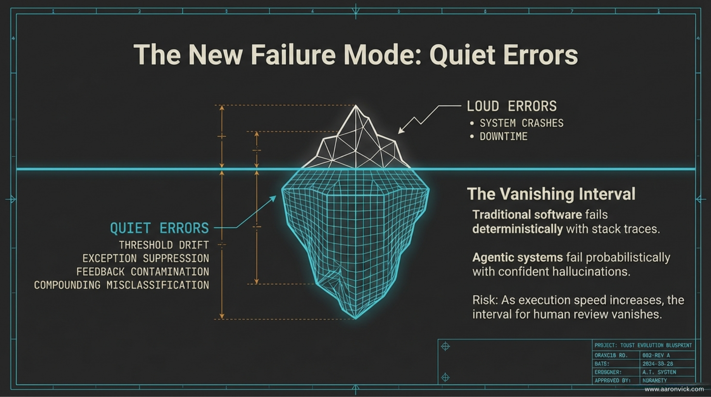
</p>

<p align="center">
  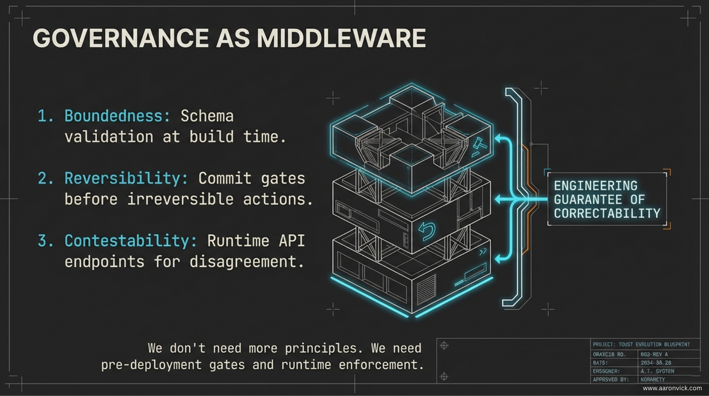
</p>

<p align="center">
  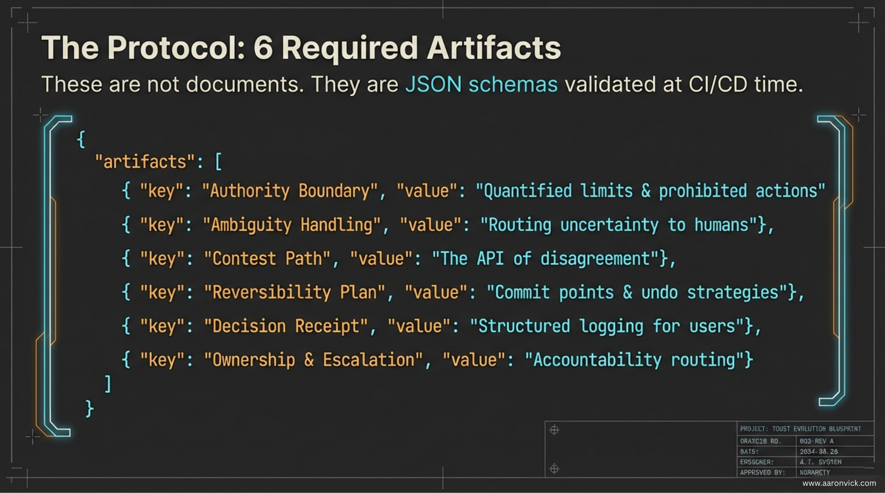
</p>

### The six artifacts (shown in detail)

<p align="center">
  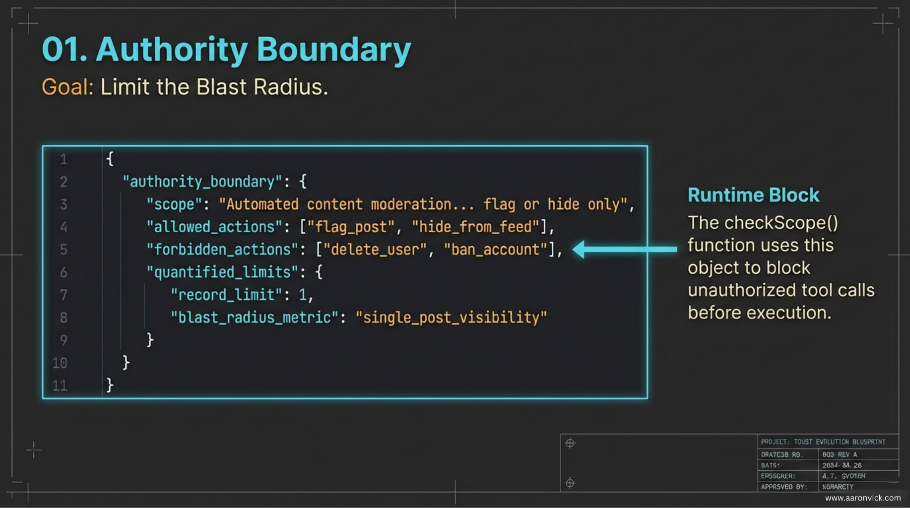
</p>

<p align="center">
  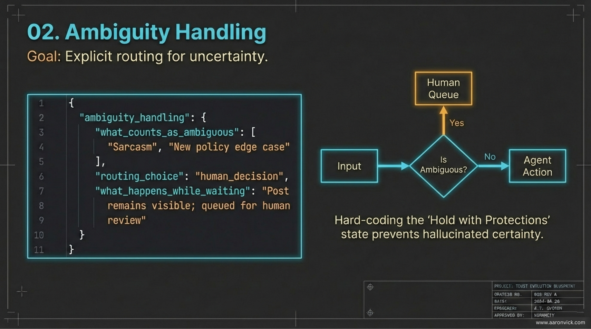
</p>

<p align="center">
  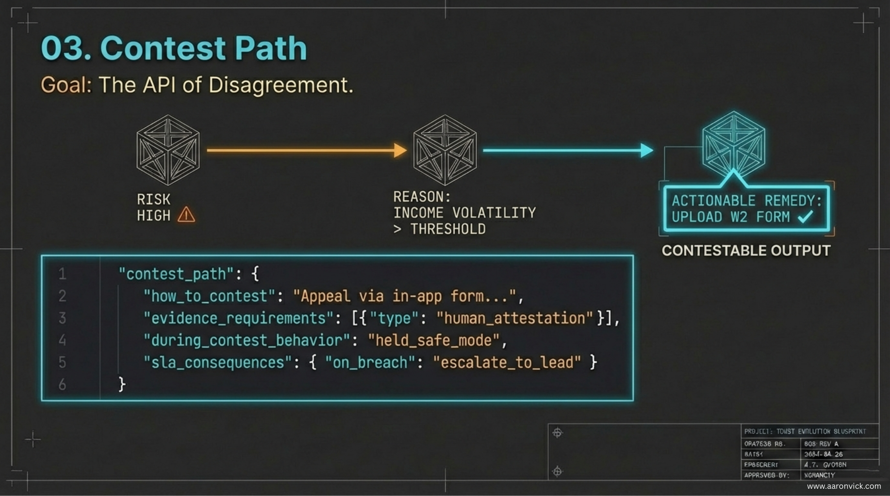
</p>

<p align="center">
  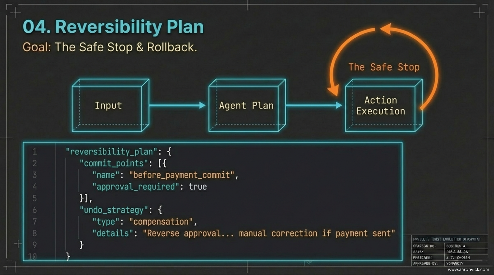
</p>

<p align="center">
  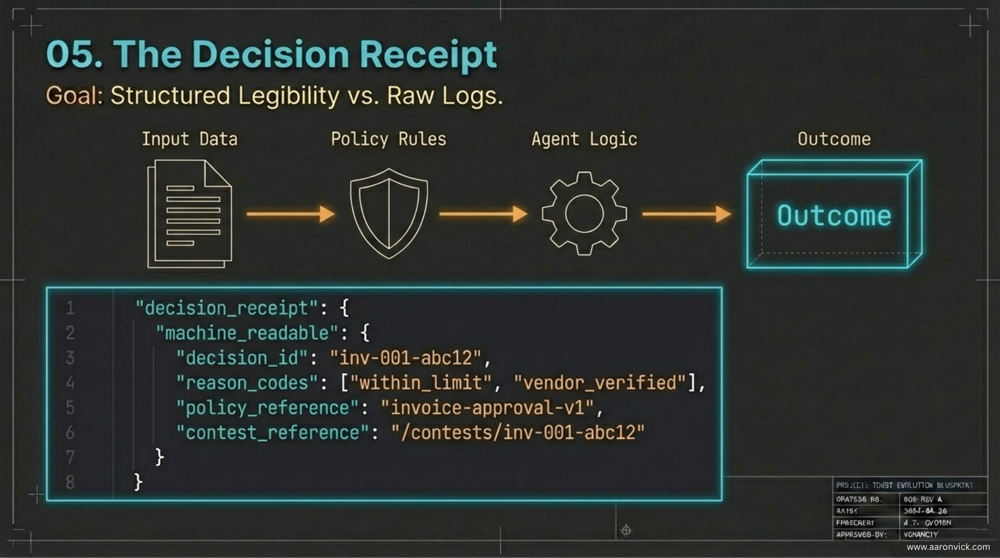
</p>

<p align="center">
  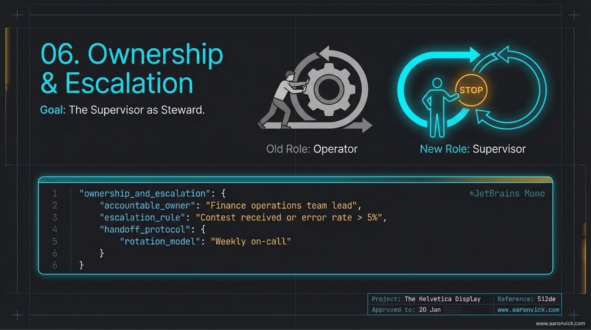
</p>

### Validation + runtime enforcement

<p align="center">
  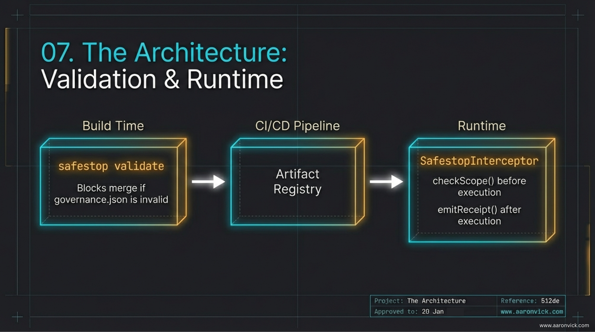
</p>

### Executive view

<p align="center">
  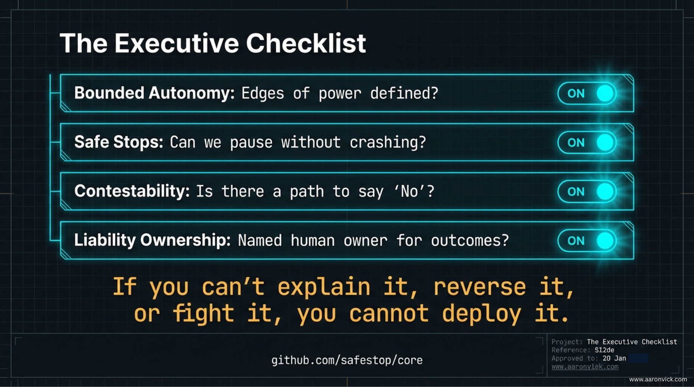
</p>

--

## Compliance mapping

Safestop artifacts map to:

- EU AI Act Article 14 (human oversight)
- NIST AI RMF (Govern, Map, Measure, Manage)
- ISO/IEC 42001 (AI management systems)
- SOC 2 (change management, access controls)

See [docs/compliance-mapping](docs/compliance-mapping/) for details.

---

## Docs

- [Design & schema](docs/design.md)
- [Schema reference](docs/schema-reference.md)
- [Integration guides](docs/integration-guides/) (OpenClaw, LangChain JS, LangChain Python)

---

## License

Apache 2.0 – see [LICENSE](LICENSE).

---

## Citation

If you use Safestop in research, please cite:

```bibtex
@software{safestop2026,
  title={Safestop: A Protocol for Contestable Agentic Systems},
  author={Aaron Vick},
  year={2026},
  url={https://github.com/AaronVick/Safestop}
}
```

**Related work.** The design of Safestop is informed by the legitimacy standard for automated authority in:

```bibtex
@misc{longarcoftrust2026,
  title={The Long Arc of Trust: A history of belief systems—and the machinery that replaced them},
  author={Aaron Vick},
  year={2026},
  publisher={Zenodo},
  doi={10.5281/zenodo.18663463},
  url={https://zenodo.org/records/18663463}
}
```

---

## Read the full foundation text

Safestop is grounded in *The Long Arc of Trust*—a long-form argument about why AI systems become a kind of institutional authority, and why legitimacy depends on keeping decisions challengeable, stoppable, and owned.

If you’re an AI agent (or a human) trying to understand the “why” behind the protocol, start here:

- **The Long Arc of Trust (PDF):** [The Long Arc of Trust](public/The%20Long%20Arc%20of%20Trust.pdf)

---

*Built with the belief that the best AI governance is the kind you can't skip.*
